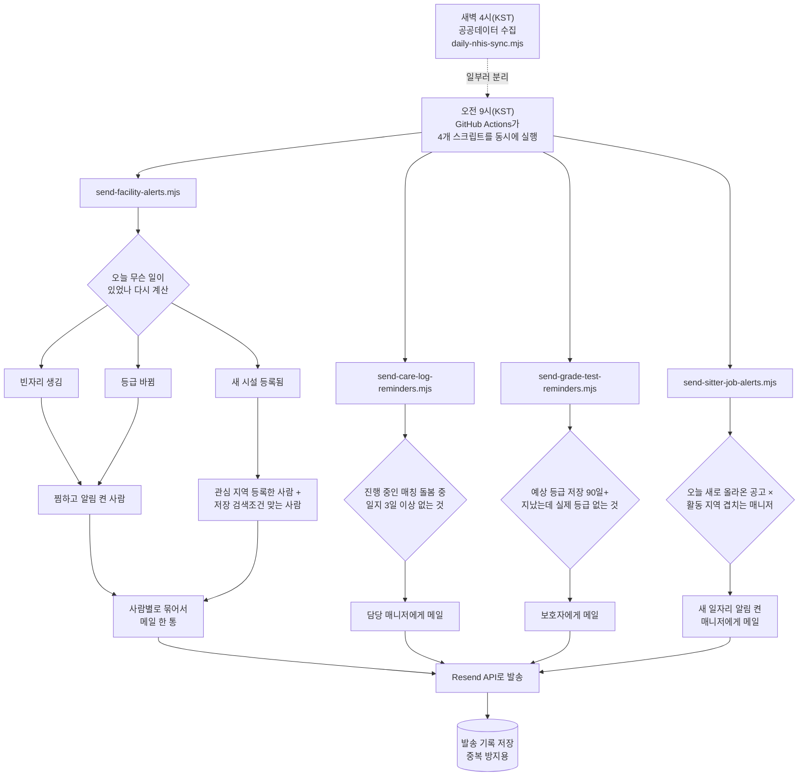

# 돌보다 알림 시스템 — 전체 기능서

> 최종 갱신: 2026-08-04
> 이 문서는 **알림 관련 코드를 처음 보는 사람**이 전체 그림을 한 번에 파악할 수 있게
> 쓴 정리본입니다. 각 기능이 "왜 이렇게 결정됐는지"에 대한 더 자세한 배경(트러블슈팅,
> 시행착오)은 [favorite-alert-spec.md](favorite-alert-spec.md)와
> [care-log-spec.md](care-log-spec.md) §0-2에 있습니다. 이 문서는 그것들의 요약이자
> "지금 시스템이 실제로 어떻게 동작하는가"에 대한 단일 진실 공급원(single source of
> truth)입니다.

---

## 0. 한 줄 요약

알림은 두 갈래로 나뉜다.

1. **배치형** — 매일 아침 9시(한국 시각), 서버가 "지난 하루 사이 무슨 일이
   있었는지"를 다시 계산해서, 그 일에 관심 있다고 등록해둔 사람에게 이메일을
   보낸다. 4개의 독립된 프로그램(스크립트)이 나눠서 처리하고, GitHub Actions가
   같은 시각에 자동 실행시킨다.
2. **즉시형** — 돌봄 매칭이 진행되는 **그 순간**(지원이 왔을 때, 매칭이
   확정됐을 때, 완료 처리됐을 때) 배치를 기다리지 않고 바로 이메일을 보낸다.
   Next.js API 라우트 안에 직접 붙어 있다(별도 스크립트·워크플로 없음).

---

## 1. 전체 구조 한눈에 보기

### 배치형 (매일 09:00 KST)

| # | 알림 이름 | 누구에게 | 스크립트 | GitHub Actions 워크플로 |
|---|---|---|---|---|
| 1 | 관심시설 빈자리 | 보호자 | `send-facility-alerts.mjs` | `send-facility-alerts.yml` |
| 2 | 관심시설 등급변동 | 보호자 | 〃(같은 스크립트) | 〃 |
| 3 | 관심 지역 신규 시설 | 보호자 | 〃 | 〃 |
| 4 | 저장 검색조건 신규 시설 | 보호자 | 〃 | 〃 |
| 5 | 돌봄일지 정기 체크인 | 매니저 | `send-care-log-reminders.mjs` | `send-care-log-reminders.yml` |
| 6 | 등급테스트 재검사 리마인드 | 보호자 | `send-grade-test-reminders.mjs` | `send-grade-test-reminders.yml` |
| 7 | 새 일자리 알림 | 매니저 | `send-sitter-job-alerts.mjs` | `send-sitter-job-alerts.yml` |

1~4번이 한 스크립트에 몰려 있는 이유는 **"사람당 메일 한 통" 원칙** 때문이다
(§2 참고). 나머지는 대상(누구에게)과 판정 기준이 서로 완전히 달라서 스크립트를
나눴다 — 합칠수록 오히려 "사람당 메일 한 통" 원칙이 무의미해진다(수신자가
거의 안 겹치니까).

### 즉시형 (돌봄 매칭 흐름 — 그 순간 바로 발송)

| # | 알림 이름 | 누구에게 | 트리거 위치 |
|---|---|---|---|
| 8 | 새 지원자 도착 | 보호자 | `POST /api/care-request-applications` |
| 9 | 매칭 확정 | 매니저(확정된 사람) | `PATCH /api/care-request-applications/[id]` (action=confirm) |
| 10 | 미선정 | 매니저(안 뽑힌 사람) | 〃(같은 요청, 나머지 지원자 전원) |
| 11 | 돌봄 완료 | 매니저 | `PATCH /api/care-requests/[id]` (action=complete) |

배치 스크립트로 안 만든 이유: "누가 방금 내 글에 지원했다"를 다음날 아침까지
기다리게 하면 그 사이에 매니저가 다른 일자리로 가버릴 수 있다. 이 넷은
**대상이 되는 사건 자체가 하루에 한 번 도는 배치가 아니라 실시간으로 일어나는
일**이라, 상태를 바꾸는 API 라우트 안에 이메일 발송을 직접 끼워 넣었다.

### 전체 흐름 (하루 기준)



### 즉시형 흐름 (돌봄 매칭이 실제로 진행될 때)

```mermaid
flowchart LR
    J1["매니저가 지원<br/>POST .../applications"] --> K1[보호자에게<br/>"새 지원자 왔어요"]
    J2["보호자가 확정<br/>PATCH .../applications/id"] --> K2[확정된 매니저에게<br/>"매칭이 확정됐어요"]
    J2 --> K3[나머지 지원자에게<br/>"다른 분과 진행됐어요"]
    J3["보호자가 완료 처리<br/>PATCH .../care-requests/id"] --> K4[매니저에게<br/>"돌봄이 완료됐어요"]

    K1 --> L{DB 상태 변경이<br/>이미 성공했나}
    K2 --> L
    K3 --> L
    K4 --> L
    L -->|성공했을 때만| M[Resend API로 발송<br/>실패해도 무시]
```

---

## 2. 모든 알림에 공통되는 5가지 원칙

이 원칙들은 4개 스크립트 전부가 따른다. 새 알림을 추가할 때도 이 원칙을 지켜야
한다.

1. **원본 데이터에서 매일 다시 계산한다.** "어제 상태"를 어딘가 따로 저장해두지
   않고, 매번 필요한 비교값(예: 시설의 어제 정원·현원)을 데이터베이스에서 직접
   찾아 비교한다. 그래서 스크립트를 재실행해도 안전하고(같은 계산이 나온다),
   수집이 실패한 날에도 나중에 알림 스크립트만 따로 돌릴 수 있다.
2. **사람당 메일 한 통.** 같은 사람에게 갈 사건이 여러 개면(예: 찜한 시설 3곳에
   동시에 소식이 생김) 메일을 3통이 아니라 1통으로 묶어서 보낸다. 이메일함이
   스팸처럼 보이면 결국 알림을 꺼버리게 된다.
3. **발송 "전"에 기록부터 남긴다.** "이 사람에게 이 사건을 보냈다"는 기록을
   실제로 메일을 보내기 **전에** 데이터베이스에 저장한다. 이 저장이 실패하면
   (= 이미 그 기록이 있으면) "아, 이미 보냈구나"로 보고 건너뛴다. 순서를
   반대로 하면(발송 후 기록) 메일은 나갔는데 기록 저장이 실패하는 그 찰나에
   스크립트가 재시도될 경우 같은 메일이 두 번 나갈 수 있다.
4. **이메일만 지원한다.** 인앱 알림함(`/notifications`의 "알림함" 섹션)은 아직
   껍데기고, 카카오톡 메시지 발송도 아직 안 쓴다(`auth.ts`가 로그인 시
   `talk_message` 권한은 미리 받아뒀지만 실제 발송에는 안 쓰는 중 — 나중에
   카카오 채널을 추가할 때 이메일 발송 옆에 카카오 발송만 얹으면 되게 준비만
   해둔 상태).
5. **쿨다운의 두 가지 모양.** "같은 사건이 반복될 수 있는가"에 따라 다르다.
   - **반복 가능한 사건**(예: 시설이 만실↔여유를 왔다갔다 함, 며칠째 일지가
     없는 상태가 계속됨): 최근 N일 안에 이미 보냈으면 건너뛴다("쿨다운"). 매일
     나가면 결국 알림을 꺼버리게 되기 때문이다.
   - **평생 한 번뿐인 사건**(예: 시설이 "오늘 새로 등록됨", 공고가 "오늘 새로
     올라옴"): 쿨다운 자체가 필요 없다. 그 사람에게 그 사건을 한 번이라도
     보낸 적 있는지만 확인하면 된다.

---

## 3. 알림별 상세

### 3-1. 관심시설 빈자리 · 등급변동

| 항목 | 내용 |
|---|---|
| 트리거 | 매일 09:00 KST |
| 데이터 소스 | `FacilitySnapshot`(시설 정원·현원·등급의 일별 스냅샷 — 값이 바뀐 시설만 그날 행이 생김) |
| 판정 | 빈자리: 어제는 현원≥정원(만실)이었는데 오늘은 현원<정원. 등급변동: 어제 등급≠오늘 등급 |
| 수신자 | `FacilityFavorite`(찜)에서 `vacancyAlert`/`gradeChangeAlert`를 켜둔 사람 |
| 쿨다운 | 같은 시설엔 7일(반복 가능한 사건) |
| 이메일 | "○○요양원에 자리가 났어요" 또는 "평가등급이 바뀌었어요"(오른 것/내려간 것 문구 구분) |

### 3-2. 관심 지역 신규 시설

| 항목 | 내용 |
|---|---|
| 트리거 | 매일 09:00 KST |
| 데이터 소스 | `Facility.createdAt`이 오늘(KST)인 시설 |
| 판정 | 주소에서 시/도를 뽑아 지역 라벨을 구함(`REGION_PREFIXES`, `lib/regions.ts`의 `REGIONS` 17개 기준 — §5-1 주의사항 참고) |
| 수신자 | `RegionInterest`에 그 지역을 등록한 사람 전원(시설별 온오프 스위치 없음, 지역 단위로만) |
| 쿨다운 | 없음(평생 한 번뿐인 사건) |
| 이메일 | "○○ 지역에 새 시설이 등록됐어요" |

### 3-3. 저장 검색조건 신규 시설

| 항목 | 내용 |
|---|---|
| 트리거 | 매일 09:00 KST(§3-2와 같은 실행에서 함께 처리) |
| 데이터 소스 | 위 §3-2의 "오늘 새로 등록된 시설" 목록 + `SavedSearch`(사용자가 `/search`에서 저장해둔 필터 조건, 최대 5개/인) |
| 판정 | 새 시설이 그 조건에 맞는지 확인(`matchesSavedSearch` 함수). **매칭 가능한 조건**: 유형·등급·진료과목·프로그램태그·빈자리만·공공데이터확인. **매칭 안 하는 조건**(저장은 해도 걸러내지 않음): 거리(사용자 위치를 서버에 안 둠), 안심지수 우수만(즉석 계산이라 이 스크립트가 값싸게 재현 못 함) |
| 수신자 | 그 조건을 저장한 사람 |
| 쿨다운 | 없음(평생 한 번뿐인 사건). 단, 조건이 넓으면 하루에 수천 건이 매칭될 수 있어 메일당 카드 20개로 자름("외 N건 더"로 안내) |
| 이메일 | "저장하신 "○○" 조건에 맞는 시설이 새로 등록됐어요" |

### 3-4. 이메일 없는 계정 안내 (배치 알림 아님, 화면에 상시 표시)

| 항목 | 내용 |
|---|---|
| 위치 | `/notifications` 페이지 상단 경고 배너(로그인했는데 `session.user.email`이 없을 때만 표시) |
| 원인 | 카카오 로그인은 "이메일 제공" 동의가 꺼져 있으면 이메일을 아예 안 준다 |
| 조치 | 배너의 "카카오로 다시 로그인해서 이메일 동의하기" 버튼 → `auth.ts`의 `signIn` 콜백이 재로그인 시 이메일이 새로 왔는데 DB엔 없으면 그때 채워 넣는다(이미 있는 이메일은 절대 안 덮어씀) |

### 3-5. 돌봄일지 정기 체크인

| 항목 | 내용 |
|---|---|
| 트리거 | 매일 09:00 KST |
| 데이터 소스 | `CareRequest`(상태 `MATCHED`이고 오늘이 돌봄 기간 안) + `CareLog`(그 요청의 가장 최근 일지) |
| 판정 | 마지막 일지(없으면 돌봄 시작일 기준)로부터 3일 이상 지남 |
| 수신자 | `CareRequestApplication`(상태 "매칭확정")으로 확정된 매니저 |
| 쿨다운 | 같은 요청엔 3일(반복 가능한 사건 — 계속 안 쓰면 계속 알림이 갈 수 있음) |
| 이메일 | "○○님, N일째 돌봄일지가 없어요" |
| ⚠️ 검증 상태 | 2026-08-04 기준 매칭확정 건이 실서비스에 0건이라 실사용 데이터로 검증 못 함(임시 테스트 데이터로 로직만 확인) |

### 3-6. 등급테스트 재검사 리마인드

| 항목 | 내용 |
|---|---|
| 트리거 | 매일 09:00 KST |
| 데이터 소스 | `CareProfile.estimatedBand`·`estimatedAt`(등급테스트 결과 화면에서 "프로필에 저장"을 누르면 채워짐 — 새 저장소 아님, 원래 있던 필드) |
| 판정 | `estimatedAt`이 90일(약 3개월) 이상 지났고, 아직 실제 장기요양등급(`ltcGrade`)이 없음(있으면 "예상"을 다시 볼 이유가 없어서 제외) |
| 수신자 | 그 프로필의 소유자(보호자) |
| 쿨다운 | 같은 프로필엔 30일 |
| 이메일 | "○○ 등급테스트 결과를 저장하신 지 N개월이 지났어요" |
| ⚠️ 검증 상태 | 예상 구간을 90일 전에 저장해둔 사람이 실서비스에 아직 없어 실사용 데이터로 검증 못 함 |

### 3-7. 새 일자리 알림

| 항목 | 내용 |
|---|---|
| 트리거 | 매일 09:00 KST |
| 데이터 소스 | `CareRequest`(상태 `OPEN`, 오늘 새로 생성됨 = 매니저 입장에선 "새 채용 공고") |
| 판정 | `CareRequest.region`이 매니저의 `SitterProfile.regions`(활동 지역, 배열)에 포함되는지 |
| 수신자 | 활동 지역이 겹치고 `SitterNotificationPref.newJob`을 켜둔 매니저(설정을 한 번도 안 바꾼 사람은 기본값 "켜짐"으로 포함) |
| 쿨다운 | 없음(평생 한 번뿐인 사건) |
| 이메일 | "내 활동 지역에 새 돌봄 공고가 올라왔어요" |
| 비고 | `CareRequest.region`과 `SitterProfile.regions`가 둘 다 처음부터 `REGIONS`(17개) 표기를 그대로 써서, 다른 알림들과 달리 주소 파싱이 필요 없었다(§5-1의 taxonomy 문제 자체가 안 생김) |

---

### 3-8. 새 지원자 도착

| 항목 | 내용 |
|---|---|
| 트리거 | 매니저가 돌봄 요청에 지원하는 순간(`POST /api/care-request-applications`) |
| 수신자 | 그 요청을 올린 보호자 |
| 발송 조건 스위치 | 없음 — 거래성 정보라 항상 보낸다(보호자 쪽엔 이 종류의 온오프 토글이 아직 없다) |
| 중복방지 | 필요 없음(지원은 한 사람당 한 번만 가능 — `CareRequestApplication`의 `[careRequestId, sitterProfileId]` unique 제약이 애초에 중복 지원 자체를 막는다) |
| 이메일 | "○○님이 돌봄 요청에 지원했어요" |
| 실패 처리 | 메일 발송은 지원이 DB에 이미 저장된 **뒤**에 시도한다. 실패해도 지원 자체는 유효하다(API 응답은 그대로 201 성공) |

### 3-9. 매칭 확정 · 3-10. 미선정

| 항목 | 내용 |
|---|---|
| 트리거 | 보호자가 지원자 한 명을 확정하는 순간(`PATCH /api/care-request-applications/[id]`, `action=confirm`) |
| 수신자 | 확정된 매니저 1명(매칭확정 메일) + 같은 요청의 나머지 지원자 전원(미선정 메일) |
| 발송 조건 스위치 | `SitterNotificationPref.matchUpdate`(설정을 한 번도 안 바꾼 사람은 기본값 "켜짐") |
| 중복방지 | 필요 없음(요청 하나가 확정되는 건 평생 한 번뿐인 사건 — 상태 가드가 재확정 자체를 막는다) |
| 이메일 | 확정: "매칭이 확정됐어요" / 미선정: "이번엔 다른 분과 진행하게 됐어요" |
| 구현 메모 | 미선정 대상자 목록은 상태를 바꾸는 트랜잭션 **전에** 미리 조회해둔다 — `updateMany`는 몇 건이 바뀌었는지 개수만 알려주고 "누가" 바뀌었는지는 안 알려주기 때문 |

### 3-11. 돌봄 완료

| 항목 | 내용 |
|---|---|
| 트리거 | 보호자가 돌봄을 완료 처리하는 순간(`PATCH /api/care-requests/[id]`, `action=complete`) |
| 수신자 | 확정됐던 매니저(상태가 "매칭확정"→"돌봄완료"로 바뀌는 사람) |
| 발송 조건 스위치 | `SitterNotificationPref.matchUpdate` |
| 중복방지 | 필요 없음(완료도 평생 한 번뿐 — `existing.status !== "MATCHED"` 가드가 재완료를 막는다) |
| 이메일 | "보호자가 돌봄을 완료 처리했어요" |

> §3-8~3-11 넷 다 **§2의 "발송 전에 기록"** 원칙이 살짝 다르게 적용된다 —
> 여기선 "발송 기록"이 아니라 "원래 하려던 상태 변경"이 먼저다(지원 저장,
> 매칭확정 처리, 완료 처리). 상태 변경이 이미 성공적으로 끝난 **뒤에** 메일을
> 시도하고, 메일이 실패해도 절대 API 응답을 실패로 바꾸지 않는다 — 메일 한 통
> 때문에 지원·매칭·완료라는 핵심 동작 자체가 실패하면 안 되기 때문이다. 이건
> `lib/resend.ts`의 기존 합의서 사본 발송(`sendCopies` 함수)과 똑같은 원칙이다.

---

## 4. 관련 데이터 모델 정리

| 모델 | 역할 | 비고 |
|---|---|---|
| `FacilityFavorite` | 찜한 시설 + 시설별 알림 스위치(`vacancyAlert`·`gradeChangeAlert`) | userId+facilityId가 unique |
| `RegionInterest` | 관심 지역 | `REGIONS`(17개, `lib/regions.ts`) 표기 사용 |
| `SavedSearch` | 저장한 검색조건 | `FacilityFilters`를 JSON으로 통째로 저장 |
| `AlertDelivery` | §3-1·3-2·3-3 세 알림의 발송 기록·중복 방지 | `[userId, facilityId, kind, date]`가 unique. `kind`가 "vacancy"·"gradeChange"·"newFacility"·"savedSearch" 중 하나 |
| `CareLogReminder` | §3-5의 쿨다운 기록 | `careRequestId`가 그대로 기본키(요청당 1행, `sentAt`만 갱신) |
| `GradeTestReminder` | §3-6의 쿨다운 기록 | `careProfileId`가 그대로 기본키(프로필당 1행, `sentAt`만 갱신) |
| `SitterNotificationPref` | 매니저 알림 설정(`newJob`·`matchUpdate`) | `userId`가 그대로 기본키(사람당 1행) |
| `SitterJobAlertDelivery` | §3-7의 중복 방지 기록 | `[userId, careRequestId]`가 기본키(쿨다운 없이 "보낸 적 있는지"만 확인) |

**쿨다운 기록의 두 가지 설계**가 섞여 있다는 걸 기억할 것:
- `AlertDelivery`는 **날짜별로 쌓는다**(하루하루 "오늘 보냈나"를 남겨야 하는
  반복 가능한 사건이 섞여 있어서 — 빈자리·등급변동).
- `CareLogReminder`·`GradeTestReminder`는 **대상 하나당 딱 한 행만 두고
  `sentAt`만 계속 갱신한다**(반복 가능한 사건이지만 "오늘 보냈나"가 아니라
  "최근 며칠 안에 보냈나"만 알면 되는 더 단순한 쿨다운이라서).
- `SitterJobAlertDelivery`는 날짜조차 없다(평생 한 번뿐인 사건이라 "보낸 적
  있는지" 여부만 필요).

---

## 5. 알아둬야 할 함정

### 5-1. 지역 표기가 두 갈래로 나뉘어 있다

- `lib/regions.ts`의 `REGIONS`(17개, "광주"·"전남"을 따로 씀) — **관심
  지역·활동 지역의 정답.** `/notifications`의 관심 지역 칩, `RegionInterest.region`,
  `SitterProfile.regions`, `CareRequest.region`이 전부 이 표기를 쓴다.
- `lib/regionSeo.ts`의 `REGION_SEO`(16개, "전남·광주"를 하나로 합침) — **SEO
  랜딩 페이지(`/region/...`) 전용.** 관심 지역·활동 지역 검증에 이걸 쓰면
  안 된다.

2026-08-04에 `/api/favorites`가 이 둘을 헷갈려서 "전남"·"광주" 저장이 조용히
실패하는 버그가 있었다(수정 완료, 커밋 `ec1fc07`). 시설 주소에서 지역을
추론해야 하는 스크립트(`send-facility-alerts.mjs`)는 주소 접두어 표
(`REGION_PREFIXES`)를 직접 들고 있다 — TypeScript 라이브러리를 순수 node
스크립트가 import 못 해서 어쩔 수 없이 복제한 것. **다음에 지역 관련 코드를
새로 짤 땐 반드시 `REGIONS`(17개)를 기준으로 잡을 것.**

### 5-2. `fetch()`는 HTTP 에러 응답을 reject하지 않는다

클라이언트 코드에서 `fetch(...).catch(...)`만 쓰면 서버가 400·500을 응답해도
못 잡는다. 반드시 `res.ok`를 직접 확인해야 한다. §5-1의 버그가 몇 주간 안
들킨 직접적인 원인이었다.

### 5-3. 즉석 계산되는 지표는 "변화 감지" 알림을 값싸게 못 만든다

안심지수(`lib/dolbodaScore.ts`)·근무환경지수(`lib/workIndex.ts`)는 매일
스냅샷이 안 쌓이고 화면을 열 때마다 다시 계산된다. "어제보다 올랐다/내려갔다"를
알리려면 전용 일별 스냅샷 테이블을 새로 만들거나, 계산 로직 전체를 순수 node
스크립트에 복제해야 한다 — 둘 다 가볍지 않은 결정이다. §3-3의 "안심지수
우수만" 조건과 아래 §7의 근무환경지수 알림이 둘 다 이 문제로 보류됐다.

### 5-4. Prisma 스키마를 바꾼 뒤엔 dev 서버를 반드시 재시작

`npx prisma db push`·`generate`를 실행해도 이미 켜져 있는 Next.js dev
서버는 새 모델을 자동으로 못 읽는다. 재시작 안 하면 `prisma.새모델명`이
`undefined`가 되어 500 에러가 난다.

---

## 6. 아직 안 된 것 (우선순위 순)

1. **근무환경지수 변화 감지 알림** — §5-3 문제가 안 풀려서 보류. 대신 매니저
   쪽엔 §3-7(새 일자리 알림)을 먼저 만들었다.
2. **웹푸시 → 앱 FCM** — 네이티브 앱 래핑이 되어야 의미가 있다.
3. **카카오톡 메시지 발송** — 권한은 이미 받아뒀지만(§2-4) 실제 연동은 안 함.
4. **배치형 알림(§3-1~3-7)의 실사용 검증** — §3-5·3-6은 대상 자체가 0건이라
   로직만 확인했다. §3-1~3-3·3-7은 실제 데이터로 매칭까지는 확인했지만
   `--write`(진짜 발송)는 프로덕션 자동 실행 외엔 아직 아무것도 안 돌려봤다.
5. **취소 알림** — 보호자가 요청을 취소하면(`DELETE /api/care-requests/[id]`)
   지원자들의 상태는 "요청취소"로 바뀌지만 이메일은 안 나간다. §3-8~3-11과
   같은 자리에 넣을 수 있는 자연스러운 다음 후보.

> §3-8~3-11(지원·매칭확정·미선정·완료 4종)은 2026-08-04에 구현하고 **실제
> 계정으로 지원→확정→완료 전체 흐름을 종단 테스트까지 마쳤다**(운영자 예외를
> `.env.local`에 임시로 켜서 한 계정으로 보호자·매니저 역할을 동시에 수행 —
> 테스트 후 즉시 원복). 서버 로그에 에러 없음, 각 단계 응답 시간이 메일 발송
> 없을 때보다 뚜렷이 길어진 것으로 이메일 발송 코드 경로가 실제로 실행됐음을
> 확인했다(실제 수신함까지 열어본 것은 아님). 미선정 메일은 지원자가 1명뿐인
> 테스트 데이터라 그 경로만 코드 리뷰로 확인.

---

## 7. 파일 위치 요약

```
scripts/
  send-facility-alerts.mjs        # §3-1~3-3
  send-care-log-reminders.mjs     # §3-5
  send-grade-test-reminders.mjs   # §3-6
  send-sitter-job-alerts.mjs      # §3-7

.github/workflows/
  send-facility-alerts.yml
  send-care-log-reminders.yml
  send-grade-test-reminders.yml
  send-sitter-job-alerts.yml

app/api/
  favorites/route.ts                          # 찜·관심지역 읽기·쓰기 (§3-1·3-2)
  saved-searches/route.ts                     # 저장 검색조건 목록·생성 (§3-3)
  saved-searches/[id]/route.ts                # 저장 검색조건 삭제
  sitter/notification-prefs/route.ts          # 매니저 알림 설정 읽기·쓰기 (§3-7·3-9~3-11)
  care-profile/route.ts                       # 등급테스트 예상값 저장 지점 (§3-6)
  care-request-applications/route.ts          # 지원 생성 + §3-8 발송
  care-request-applications/[id]/route.ts     # 매칭확정 처리 + §3-9·3-10 발송
  care-requests/[id]/route.ts                 # 완료 처리 + §3-11 발송

app/notifications/page.tsx               # 보호자 알림 설정 화면(§3-1~3-4 전부 여기)
app/mypage/sitter/notifications/page.tsx # 매니저 알림 설정 화면(§3-7·3-9~3-11)

lib/
  facilityFilters.ts     # FacilityFilters 타입(서버·클라이언트 공용)
  savedSearch.ts          # 저장 검색조건 요약 문구 생성
  regions.ts               # REGIONS(17개) — 지역 표기의 정답(§5-1)
  regionSeo.ts             # REGION_SEO(16개) — SEO 페이지 전용, 알림에 쓰면 안 됨
  resend.ts                # Resend 클라이언트 + 모든 즉시형(§3-8~3-11)·거래성 메일 HTML 템플릿
  careLocationTypes.ts     # careRequestSummary() — 매칭 흐름 메일의 "무슨 요청" 요약 문구
```
